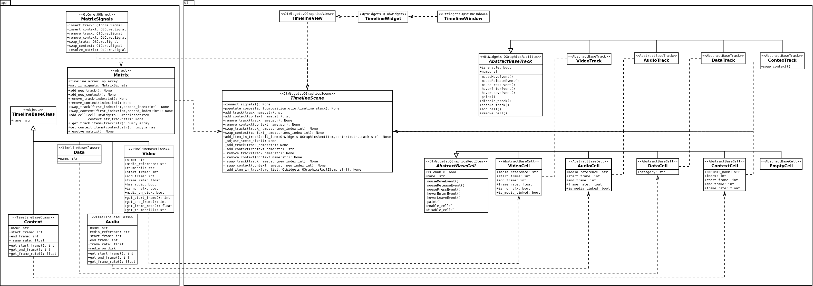

# Timeline 


OpenTimelinIO based timeline.

#### Usage

```
cd timeline/
python console.py
```

### Dependencies

* Python 3.6 <
* PySide2 5.14.2 <
  ```
  pip install PySide2
  ```
* OpenTimelineIO 0.13.0.dev1 <
  ```
  pip install OpenTimelineIO
  ```
* numpy > 1.18.2
  ```
  pip install numpy
  ```

### UML Diagram 



### Task list

- [x] Load edl/otio
- [ ] Create otio/edl
  - [ ] Edit timeline
  - [ ] Add/remove context
  - [x] Add/remove track
  - [x] Enable/disable track
  - [ ] Enable/disable context
  - [ ] Remove cell
  - [ ] Cell disabiling
  - [ ] Swap contexts
  - [ ] Swap tracks
  - [ ] Export otio/edl
- [ ] Resolve timeline
  - [ ] Video: topmost video item
  - [ ] Audio: topmost audio item
  - [ ] Source: topmost source item
  - [ ] Data: topmost data of each category
- [ ] Should able to change active frame range of each context.
- [ ] Compact able to different players (rv, nuke)
  
### To resolve

- [ ] Audio offset
- [ ] Video offset (mov, src)
- [ ] Play in cut
- [ ] Hybrid sequence
- [ ] *audio issue
- [ ] Unsynced dailies
- [ ] Handle non vfx shots

### Credits
  - icons: https://icons8.com